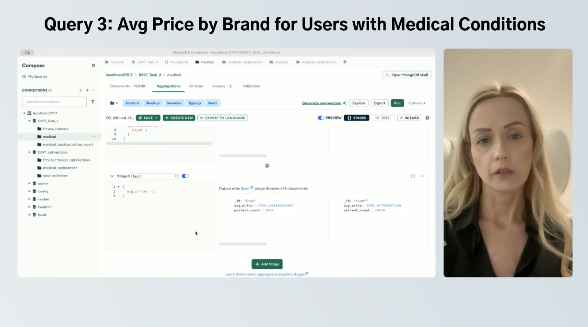

# 🍃 HealthFit Data Analysis – MongoDB Aggregations


---

# Project Overview

This project demonstrates how **MongoDB aggregation pipelines** can be used to transform raw health tracker data into actionable business and healthcare insights.

The analysis combines demographic and device data to answer business questions related to customer segmentation, device popularity, and pricing. Each aggregation pipeline includes both an original implementation and an optimized version to demonstrate query optimization techniques and performance improvements.

---

# Business Question

How can MongoDB aggregation pipelines be used to generate actionable insights from health tracker data while improving query performance?**

---

## Project Outcomes

<p align="center">
  
</p>

# Skills Demonstrated

- MongoDB Aggregation Pipelines
- NoSQL Database Design
- Query Optimization
- Data Integration
- Business Analytics
- Healthcare Analytics
- Python (PyMongo)
- JavaScript (Mongo Shell / Node.js)

---

# Technologies

- MongoDB
- Python
- PyMongo
- JavaScript
- Mongo Shell
- Node.js

---

# 🎥 Project Walkthrough

A complete walkthrough of the project is available on Vimeo. The presentation explains the database design, aggregation pipelines, optimization techniques, and business insights generated from the HealthFit dataset.

▶️ **Watch the Project Presentation**

https://vimeo.com/1205140119

---

# Design Process

This repository also includes a separate design walkthrough explaining the planning and implementation decisions behind the project.

<p align="center">
  <a href="https://vimeo.com/1101080044/6d02eeb9ff" target="_blank">
    
    <br/>
    ▶️ Watch the Design Process
  </a>
</p>

---

# Project Goals

### Age Group Segmentation

Merge demographic and health tracker data to support customer segmentation and targeted health insights.

### Popular Device Models

Identify the most commonly used wearable devices among individuals with health conditions to support business partnerships and healthcare recommendations.

### Average Price Analysis

Evaluate relationships between device pricing and popularity to support affordability and purchasing decisions.

---

# Repository Structure

Each aggregation pipeline contains both original and optimized implementations in Python and JavaScript.

```text
pipelines/
├── age_group/
│   ├── age_group.py
│   ├── age_group.js
│   ├── age_group_optimized.py
│   └── age_group_optimized.js
│
├── avg_price/
│   ├── avg_price.py
│   ├── avg_price.js
│   ├── avg_price_optimized.py
│   └── avg_price_optimized.js
│
└── popular_models/
    ├── popular_models.py
    ├── popular_models.js
    ├── popular_models_optimized.py
    └── popular_models_optimized.js
```

---

# Running the Project

Clone the repository:

```bash
git clone https://github.com/joannar77/healthfit-mongodb-project.git
cd healthfit-mongodb-project
```

### JavaScript (Mongo Shell)

```bash
mongo < pipelines/age_group/age_group.js
```

### Python (PyMongo)

```bash
python pipelines/age_group/age_group.py
```

---

# Key Insights

The aggregation pipelines demonstrate how MongoDB can efficiently support business intelligence by:

- Integrating multiple collections
- Segmenting customers by demographic characteristics
- Identifying popular wearable device models
- Comparing pricing across manufacturers
- Optimizing aggregation performance for large datasets

---

# Business Value

This project demonstrates how NoSQL databases can support data-driven decision making by:

- Improving customer segmentation
- Supporting healthcare analytics
- Identifying product adoption trends
- Evaluating pricing strategies
- Optimizing complex aggregation queries

---

# Repository Contents

- MongoDB aggregation pipelines
- Optimized aggregation pipelines
- Python implementations
- JavaScript implementations
- HealthFit sample dataset
- Project documentation

---

# Author

**Joanna Ronchi**

- Master of Science in Data Science
- Bachelor of Science in Information Technology Management

GitHub: https://github.com/joannar77
